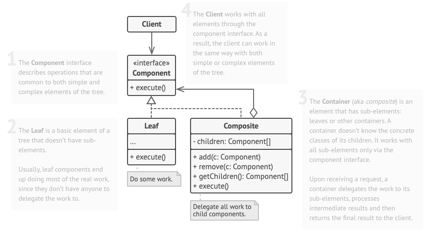

# Composite Pattern

* Composite is a structural design pattern that lets you compose objects into tree structures and then work with these structures as if they were individual objects.
* Use the pattern when you want the client code to treat both simple and complex elements uniformly.

