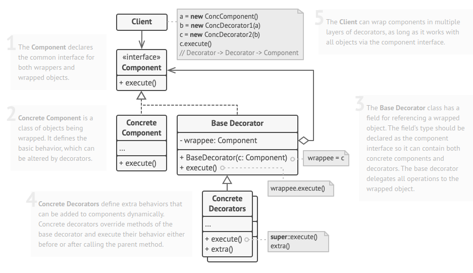

# Decorator Pattern

* Decorator is a structural design pattern that lets you attach new behaviors to objects by placing these objects inside special wrapper objects that contain the behaviors.
* “Wrapper” is the alternative nickname for the Decorator pattern that clearly expresses the main idea of the pattern. A wrapper is an object that can be linked with some target object. The wrapper contains the same set of methods as the target and delegates to it all requests it receives. However, the wrapper may alter the result by doing something either before or after it passes the request to the target.

## A Fries shop

Consider a Fries shop application that determines the cost of a pack of fries.
Now we can have a class for each type of pack of fries:
- small
- medium
- large
- with salt
- without salt
- with ketchup
- without ketchup
- ...

and all other possible combinations. This doesn't seem like a valid solution. If the base price of a pack of fries would change, all classes have to change too.

Ok since we know about inheritance, we could create a basic `NormalFries` class and inherit from that for `Medium`, `Small` and `Large` and we could add all the possible options in the base class: `hasSalt`, `hasKetchup`, ...

There are some problems here:
* What if the customer wants double ketchup ?
* What if we want to add more toppings? Then we have to change the base class.
* This works for Fries but for none of the other products we may be selling