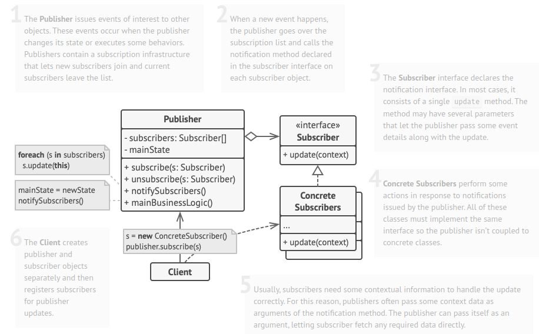

# The Observer Pattern

* The Observer Pattern defines a one-to-many dependency between objects so that when one object changes state, all of its dependents are notified and updated automatically.
* When two objects are loosely coupled, they can interact, but have very little knowledge of each other.
* The Observer Pattern provides an object design where subjects and observers are loosely coupled.

